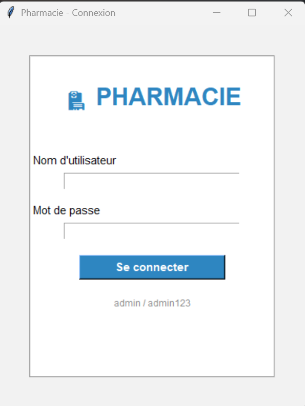
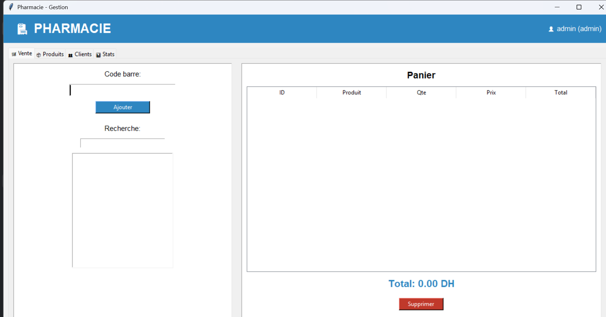
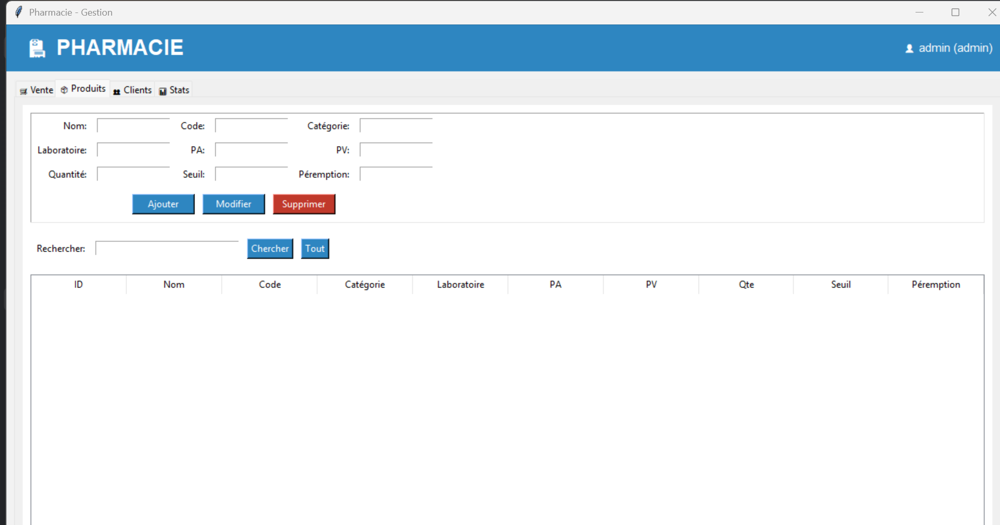
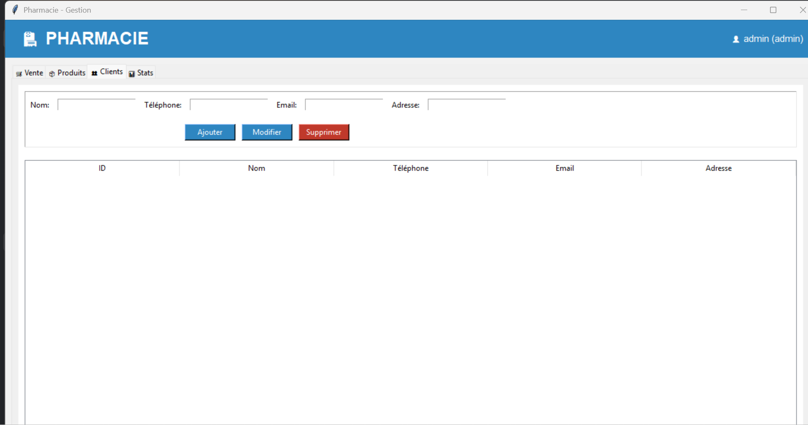
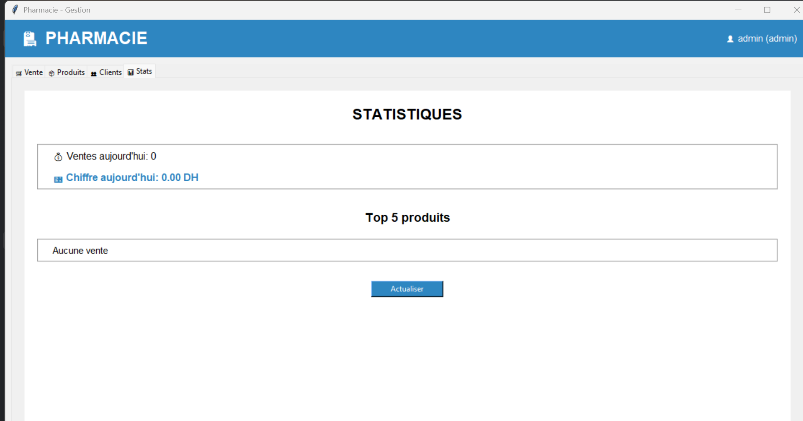

# 🏥 Système de Gestion de Pharmacie(Projet-Tkinter-2)

## 📋 Description

Application de bureau complète pour la gestion d'une pharmacie. Développée avec **Python** et **Tkinter**, cette solution permet de gérer les produits, les ventes, les clients et de générer des rapports statistiques.

## ✨ Fonctionnalités

### 🛒 Point de Vente
- Scan par code barre
- Recherche de produits
- Panier dynamique
- Gestion des clients
- Multiples modes de paiement (Espèces, Carte, Chèque)

### 📦 Gestion des Produits
- Ajout / Modification / Suppression
- Code barre automatique
- Seuil d'alerte stock
- Date de péremption
- Recherche multicritères

### 👥 Gestion des Clients
- Carnet d'adresses complet
- Ajout / Modification / Suppression
- Recherche par nom ou téléphone

### 📊 Statistiques
- Ventes du jour
- Top 5 des produits
- Alertes stock faible
- Alertes expiration

## 🖼️ Captures d'écran

### Écran de Connexion
```

```

### Interface Principale - Point de Vente
```

```

### Gestion des Produits
```

```

### Gestion des Clients
```

```

### Statistiques et Alertes
```
```

## 🚀 Installation

### Prérequis
- Python 3.8 ou supérieur
- Pip (gestionnaire de paquets Python)

## 🔐 Connexion(par defaut)

| Rôle | Nom d'utilisateur | Mot de passe |
|------|-------------------|--------------|
| Administrateur | `admin` | `admin123` |

## 📁 Structure du Projet

```
gestion_pharmacie/
│
├── main.py
│            
├── pharmacie.db         
│
├── assets/                
│   └── logo.png
│
└── backups/              
    └── pharmacie_backup_*.db
```

## 🛠️ Technologies Utilisées

| Technologie | Usage |
|-------------|-------|
| Python 3.11 | Langage principal |
| Tkinter | Interface graphique |
| SQLite3 | Base de données locale |
| Hashlib | Cryptage des mots de passe |
| Secrets | Génération de sel cryptographique |
| Datetime | Gestion des dates |
| Pillow | Gestion des images |

## 📊 Base de Données

### Tables

| Table | Description |
|-------|-------------|
| `utilisateurs` | Gestion des comptes (admin/pharmacien/stagiaire) |
| `produits` | Catalogue des produits médicaux |
| `clients` | Carnet d'adresses des clients |
| `ventes` | En-têtes des factures |
| `vente_details` | Lignes des factures |

### Relations
```
ventes (1) ────── (n) vente_details
vente_details (n) ────── (1) produits
ventes (n) ────── (1) clients
```

## 🎨 Palette de Couleurs

| Élément | Couleur | Code Hex |
|---------|---------|----------|
| Fond principal | Gris clair | `#F2F2F2` |
| Fond des sections | Blanc | `#FFFFFF` |
| Bouton principal | Bleu | `#2E86C1` |
| Bouton danger | Rouge | `#C0392B` |
| Bouton succès | Vert | `#27AE60` |
| Texte principal | Gris foncé | `#333333` |

## 🔧 Utilisation

### Ajouter un produit
1. Allez dans l'onglet **"📦 Produits"**
2. Remplissez le formulaire
3. Cliquez sur **"Ajouter"**

### Effectuer une vente
1. Allez dans l'onglet **"🛒 Vente"**
2. Scannez le code barre ou recherchez un produit
3. Sélectionnez un client (optionnel)
4. Cliquez sur **"Valider"**

### Consulter les statistiques
1. Allez dans l'onglet **"📊 Stats"**
2. Les ventes du jour et le top 5 s'affichent automatiquement

## ⚠️ Alertes Automatiques

- ✅ **Stock faible** : alerte quand quantité ≤ seuil
- ✅ **Expiration proche** : alerte à 30 jours de la péremption
- ✅ Affichage dans l'onglet Statistiques

## 📈 Évolutions Possibles

- [ ] Génération de factures PDF
- [ ] Export Excel des rapports
- [ ] Sauvegarde/Restauration automatique
- [ ] Mode sombre/clair
- [ ] Impression de reçus
- [ ] Graphiques avec Matplotlib
- [ ] Notifications push

## 👨‍💻 Auteur

**Développé dans le cadre d'un projet de formation**

- Filière : Développement Digital
- Niveau : 1ère année
- Année : 2025/2026

---

## ⭐ Si vous aimez ce projet

N'hésitez pas à ⭐ le dépôt GitHub et à le partager !
